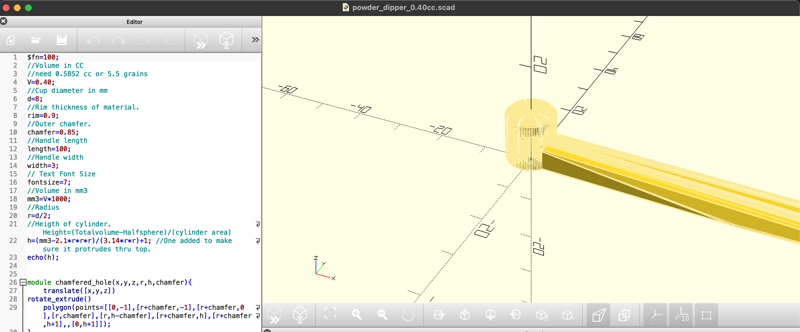
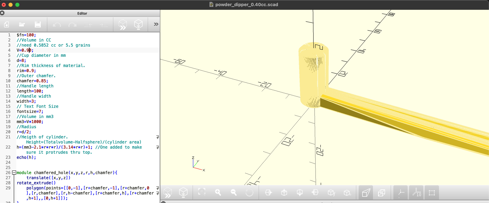

# PowderScoopers3DPrinter

A number of Powder Scoopers for the 3D Printer.  Some of the projects have already been created for a certain CC, but you can use and edit the SCAD file and edit the scoopers to the size that you need it.

## About OPENSCAD
OpenSCAD is software for creating solid 3D CAD objects.
It is free software and available for Linux/UNIX, MS Windows and Mac OS X.

OpenSCAD is software for creating solid 3D CAD models. It is free software and available for Linux/UNIX, Windows and Mac OS X. Unlike most free software for creating 3D models (such as Blender) it does not focus on the artistic aspects of 3D modeling but instead on the CAD aspects. Thus it might be the application you are looking for when you are planning to create 3D models of machine parts but pretty sure is not what you are looking for when you are more interested in creating computer-animated movies.

OpenSCAD is not an interactive modeler. Instead it is something like a 3D-compiler that reads in a script file that describes the object and renders the 3D model from this script file. This gives you (the designer) full control over the modeling process and enables you to easily change any step in the modeling process or make designs that are defined by configurable parameters.

OpenSCAD provides two main modeling techniques: First there is constructive solid geometry (aka CSG) and second there is extrusion of 2D outlines. Auto-cad DXF files can be used as the data exchange format for such 2D outlines. In addition to 2D paths for extrusion it is also possible to read design parameters from DXF files. Besides DXF files OpenSCAD can read and create 3D models in the STL and OFF file formats.

If you do not have OpenSCAD installed, you can goto [OpenSCAD](https://openscad.org) and download the application.

## Making a new Scooper
If you wanted to make a new scooper, Just copy or clone of of the existing, rename the copy to the size you want it, then open it up in OpenSCAD.
On the 4th Line, just change the value that you want the size to be.  Then click on render, wait till it renders, then preview.  Now it is ready to export to STL File for you to use in your 3D Printer.

### Before

### After

## Change Log

### v1.0.0

* Initial Release

